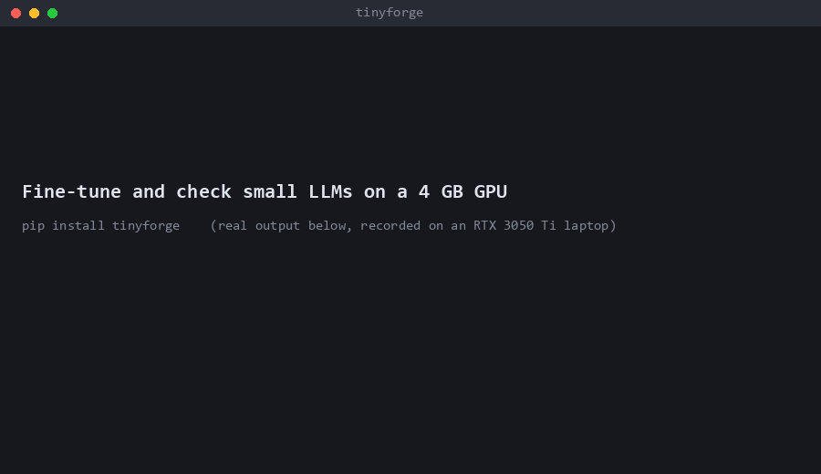
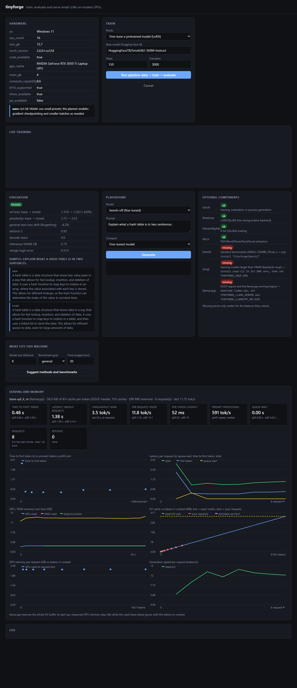

# tinyforge

[](https://pypi.org/project/tinyforge/)
[](https://pypi.org/project/tinyforge/)
[](LICENSE)
[](https://github.com/rajratangm/tinyforge/actions)

> **Fine-tune an 8B model on a 4 GB laptop GPU, then find out whether it is actually any good.**
> `pip install tinyforge` gives you data prep, LoRA/QLoRA training, quality gates that fail bad models
> (instead of printing "passed"), GGUF export and an OpenAI-compatible server, with plain-English warnings at every step.

**Why it exists:** most fine-tuning guides stop at "loss went down". tinyforge checks the model against its base,
tests for forgetting, and refuses to call a random-weight model good. Every number in
[Verified results](#verified-results-what-was-actually-run) comes with a raw JSON file and its caveats, including the
result where fine-tuning did **not** help (98% vs 97%).



**Try the result:** the 3B text-to-SQL adapter trained this way is on Hugging Face: [RajGMore/tinyforge-qwen2.5-3b-titanic-sql-lora](https://huggingface.co/RajGMore/tinyforge-qwen2.5-3b-titanic-sql-lora) (7 MB, with the caveats in its model card).

**Watch a full run (6 min, narrated):** [doctor -> data -> plan -> train -> eval gate -> serve](docs/images/tinyforge-end-to-end.mp4), recorded from one real run on a 4 GB laptop GPU (training sped up; it took 6 min 23 s).

More: [honest comparison with Unsloth, Axolotl and LLaMA-Factory](docs/compare.md) · [Hugging Face collection](https://huggingface.co/collections/RajGMore/tinyforge-fine-tuned-on-a-4-gb-gpu-6ac8756a71fe1a822bce9527) (3B and 8B text-to-SQL adapters).

If it saves you an evening, a star helps other people with small GPUs find it.

Train, evaluate and serve **small LLMs from scratch on modest GPUs** (developed against a 4 GB RTX 3050 Ti).
One engine, three front doors: **CLI** (for developers/CI), **REST API**, and a **web UI** (which can later be
wrapped as a desktop app with Tauri/Electron without changing the backend).

**Status: early alpha (0.1).** Tested on Windows (RTX 3050 Ti), on Linux (a Colab T4) and on a Kaggle 2x T4 machine (data-parallel
LoRA works, but scales only 1.2-1.4x); Kubernetes-with-GPU is not tested yet. Step-by-step Linux, Windows and Colab instructions: [`docs/install.md`](docs/install.md).
Install: `pip install tinyforge`, then `tinyforge doctor` to see what else you need
(PyTorch, `pip install "tinyforge[finetune]"`, and optional pieces such as Soup and llama.cpp).

## Quick start

The same commands work on Linux and Windows (venv activation, environment variables and `curl` differ: see
[`docs/installation_guides/install.md`](docs/install.md) for both). Also available in
[Hindi](docs/installation_guides/install.hindi.md), [Español](docs/installation_guides/install.spanish.md) and [简体中文](docs/installation_guides/install.zh-chinese.md).

```bash
python3 -m venv .venv && source .venv/bin/activate        # Windows: py -3 -m venv .venv ; .venv\Scripts\Activate.ps1
pip install torch --index-url https://download.pytorch.org/whl/cu124   # or /cpu
pip install tinyforge               # or, from a clone: pip install -e ".[dev]"
tinyforge doctor                   # hardware + warnings, with fixes
tinyforge pipeline --preset micro --steps 2000   # doctor -> data -> plan -> train -> eval
tinyforge generate "ROMEO:" --int8
tinyforge serve                    # UI at http://127.0.0.1:8000
```

## Use your own data and your own model (step by step)

You need three things: **your data** (a file or folder), **a model** (any chat/instruct model from
[huggingface.co/models](https://huggingface.co/models), up to about 3B for a 4 GB GPU) and **one command**.
Everything it makes lands in one folder you choose, so nothing is scattered.

**Step 1. Make a clean Python environment.**
```bash
python3 -m venv .venv && source .venv/bin/activate        # Windows: py -3 -m venv .venv ; .venv\Scripts\Activate.ps1
```

**Step 2. Install.** Use `/cpu` instead of `/cu124` if you have no NVIDIA GPU (much slower).
```bash
pip install torch --index-url https://download.pytorch.org/whl/cu124
pip install "tinyforge[finetune]"
tinyforge doctor        # shows your GPU, and which optional parts are missing
```

**Step 3. Put your data somewhere.** Any one of these works:

| Your data | What to pass | What tinyforge does |
|---|---|---|
| A folder of `.txt` / `.md` / `.html` files | `my_files` | cuts it into ~100-word passages and makes "finish this text" examples |
| One document | `notes.md` | same |
| PDF, Word, PowerPoint, Excel | `pip install "tinyforge[docs]"`, then pass the folder | same, after extracting the text |
| Question/answer examples | `examples.jsonl`, one JSON per line, e.g. `{"instruction": "What is X?", "output": "X is ..."}` (or `{"messages": [...]}`) | uses it as it is |

**Step 4. Pick your model.** Copy its id from its Hugging Face page (the `owner/name` at the top). Prefer names with
"instruct" or "chat" (a model with no chat template is rejected with `FD007`). Private or gated model? Run
`huggingface-cli login` first. Not sure what fits? `tinyforge ft plan --base-model owner/name` answers in seconds.

**Step 5. Run it.**
```bash
tinyforge easy my_files --model HuggingFaceTB/SmolLM2-360M-Instruct --workdir my_run
```
`--steps 100` is a good start for a small folder. Five numbered steps print in plain words: read your files, check the examples
(duplicates, passwords, personal data), check the model fits your GPU, train, test.

**Step 6. Find your results.** All under `my_run/` (default `tinyforge_easy/`):

| Path | What it is |
|---|---|
| `examples.jsonl` | the training examples made from your files; open it to see exactly what the model learned from |
| `data/train.jsonl`, `data/val.jsonl`, `data/meta.json` | the cleaned split and its counts |
| `model/best/` | your tuned model (a small LoRA adapter, the best checkpoint) |
| `model/merged/` | the same, merged into a normal Hugging Face model folder |
| `model/eval.json` | the test report: loss before vs after, forgetting, sample answers |

**Step 7. Talk to it, and compare with the original.**
```bash
tinyforge ft generate "your question here" --run-dir my_run/model
tinyforge ft generate "your question here" --run-dir my_run/model --base
```

**If something goes wrong**
- *"Too little text"*: the data gate refuses a handful of examples on purpose. About 100 passages of ~100 words is the
  minimum; the gate warns below 500 (expect style, not knowledge).
- *The model only repeats your wording and cannot answer questions*: files alone teach wording. Add `--teacher-url
  http://.../v1` (any OpenAI-compatible chat endpoint) and a teacher model writes grounded question-and-answer pairs from
  your files first. Or write your own `.jsonl` (Step 3).
- *Val loss got worse (FT002)*: it trained too long for so little data. The best checkpoint is already kept; use fewer
  `--steps`.
- *Out of memory*: pick a smaller model, or run `tinyforge memory`.

## What you get

| Stage | What it does | Guard rails (warning codes) |
|---|---|---|
| `doctor` | GPU/VRAM/bf16/Triton/JAX probe | HW001-HW008 |
| `data prepare` | download or ingest text, train BPE, contiguous train/val split | DQ001-DQ005: tiny corpus, duplicates, bad vocab |
| `plan` | VRAM estimate; auto-enables grad checkpointing, shrinks micro-batch, keeps effective batch | PL001-PL005 |
| `train` | AMP (bf16/fp16+scaler), grad accumulation, cosine LR, atomic checkpoints, auto-resume | TR001 NaN skip/abort, TR002 overfit, TR003 plateau |
| `eval` | perplexity vs random baseline, diversity, memorisation, determinism, KV-cache correctness, speed/VRAM | EV001-EV009, non-zero exit on failure |
| `generate`/`serve` | KV-cache decoding, top-k/top-p, int8 weights, optional Triton RMSNorm | |

### Fine-tuning platform commands

| Command | What it does |
|---|---|
| `memory` | probe VRAM/RAM/disk and say where a model's frozen weights would live and the estimated speed |
| `data ingest` | documents (txt, md, html; pdf/docx/pptx/xlsx with the `docs` extra) -> cleaned, chunked, de-duplicated JSONL |
| `data tabular` | CSV -> text-to-SQL examples whose answers are verified by executing them (`--hard` for eval shapes) |
| `data pairs` | chunks -> grounded Q&A pairs from a teacher model (any OpenAI-compatible endpoint), split before generation |
| `data pii-scan`, `--pii` | find emails, phones, cards, IDs and credentials; flag, redact or drop |
| `worker run --spec job.yaml` | run a TrainingJob; `backend: native` or `soup` (layer streaming for models larger than VRAM) |
| `export gguf` | adapter + base -> GGUF for llama.cpp |
| `bench list/suggest/run` | pick benchmarks sized to your GPU/RAM/time budget (MMLU, ARC, HellaSwag, GSM8K, IFEval via lm-evaluation-harness, plus a built-in SQL execution check) and run them, base vs tuned |
| `serve [--engine llamacpp]` | API + UI; OpenAI-compatible `/v1/chat/completions` with guardrails and metrics |

Verified on one RTX 3050 Ti 4 GB laptop (Windows): a 3B and an 8B model fine-tuned through the job spec and served
locally; see `benchmarks/` and `docs/soup-backend.md`. Early alpha: single GPU; Windows and a Linux Colab T4 tested.

Model: decoder-only transformer with RoPE, RMSNorm, SwiGLU, tied embeddings, PyTorch SDPA (FlashAttention kernels).
Presets: `nano` ~1M, `micro` ~12M, `small` ~28M, `base` ~100M.

## Fine-tune a pretrained model (LoRA / QLoRA)

The most useful thing a small GPU can do. Default: `SmolLM2-360M-Instruct` on an instruction dataset.

```bash
pip install -e ".[finetune]"
tinyforge ft pipeline --steps 150          # doctor -> data -> plan -> train -> eval + merge
tinyforge ft generate "Explain hash tables" # tuned model;  add --base to compare with the original
```

| Stage | What it does | Guard rails |
|---|---|---|
| `ft data` | JSONL or HF dataset -> chat JSONL; dedupe; hash split keyed on prompt (no leakage); length stats | FD001-FD006: too few examples, duplicates, malformed, tiny val set, truncation, PII/credentials (credentials are dropped) |
| `ft plan` | picks fp16 vs 4-bit NF4, checkpointing, and a **token budget** per micro-batch to fit VRAM | FP001-FP007 |
| `ft train` | LoRA, length-grouped token-budget batching, resume, best-adapter tracking | FT001 NaN, FT002 overfit, FT005 VRAM spill, FT006 adaptive OOM recovery |
| `ft eval` | tuned vs base held-out loss, forgetting check on general text, side-by-side generations, merge + equivalence check | FE001-FE009; exit 1 if tuned is not better than base |

Measured on an RTX 3050 Ti Laptop (4 GB), SmolLM2-360M, 150 steps x 16 examples: 2.4 GB peak VRAM, ~830 tok/s,
~10 min, held-out loss 1.314 -> 1.262 (-4.0%), no forgetting; exports a 690 MB standalone merged model.
Lessons baked into the planner (all measured, see `finetune.plan`): small micro-batches are launch-bound (bs8 is
2.3x the tokens/s of bs4), LoRA dropout 0 is ~40% faster, and allocator-level estimates miss cuBLAS workspace, so
training recovers from memory errors by shrinking the token budget instead of crashing.

## Layout

```
src/tinyforge/   engine (config, data, model, train, evaluate, infer, kernels/), cli.py, server.py, ui/
tests/           unit + end-to-end smoke (synthetic data, no network)
infra/terraform/ S3 artifacts, IAM, no-inbound GPU spot worker (SSM access), budget alarm
.github/         CI: lint, test matrix, terraform validate, docker build, self-hosted GPU e2e
Dockerfile       CUDA runtime image
```

## Cloud (AWS)

```bash
cd infra/terraform
terraform init -backend-config="bucket=<state-bucket>" -backend-config="key=tinyforge/tf.tfstate"
terraform apply -var enable_gpu_worker=true -var alert_email=you@example.com
# then run the `connect` output command to port-forward the UI over SSM (no open ports)
```

## Verified results (what was actually run)

Unless a row says otherwise it was run on one machine: **Windows 11, RTX 3050 Ti Laptop GPU (4 GB), 16 GB RAM**. Each row links to the
raw numbers. These are single runs on small test sets, not benchmarks: read the caveats in each JSON file.

| What was tested | Result | Data |
|---|---|---|
| Llama-3.1-8B fine-tuned on a 4 GB GPU (layer streaming through the job spec), served with llama.cpp | trained 200 steps in 9.5 min; on 100 questions about a table it never saw: **100%** execution accuracy vs **93%** for the same model told to reply with SQL only | [`e8-penguins-8b-soup.json`](benchmarks/e8-penguins-8b-soup.json) |
| Same 8B model, harder question shapes never used in training | **98%** vs **97%**: no meaningful gain over a well-prompted base model. Fine-tuning mostly fixed output format | [`e8-penguins-8b-hard.json`](benchmarks/e8-penguins-8b-hard.json) |
| Qwen2.5-3B fine-tuned end to end (data -> train -> evaluate -> serve) | **98%** execution accuracy vs **70%** for the base model told to reply with SQL (0% without that instruction) | [`e2e-titanic-3b-soup.json`](benchmarks/e2e-titanic-3b-soup.json) |
| `tinyforge ft pipeline --steps 100 --limit 500` on a fresh `pip install` (SmolLM2-360M-Instruct, 474 Alpaca examples, 4 GB laptop GPU, bf16, no quantization) | passed the gate: held-out loss **1.413 -> 1.374 (-2.7%)**, general-text loss 1.563 -> 1.526 (no forgetting), 2.3 GB peak training memory, ~2,100 tok/s. Only a small style change on 474 examples (the tool itself warns FD001: style transfer, not new knowledge). Generations stay close to the base model's | no JSON file; terminal output of one run |
| `tinyforge easy docs --steps 100` on this repo's own `docs/` folder (74 KB -> 135 "finish this text" examples, same model and GPU, ~2 GB peak) | passed the gate: held-out loss **4.364 -> 4.032 (-7.6%)** at the best checkpoint (step 50), general-text loss 1.563 -> 1.547 (no forgetting). Validation loss then rose to 4.44 by step 100 (overfitting, FT002), so the tool kept the step-50 adapter. Tiny data: it learns the wording of the docs and cannot answer questions about them (asked a new question, it replied with a generic greeting) | no JSON file; terminal output of one run |
| Soup-trained adapter, quality check (3B) | exact match 4% -> 45%, SQL that runs 9% -> 88% on 100 held-out rows | [`soup-adapter-check-qwen3b.json`](benchmarks/soup-adapter-check-qwen3b.json) |
| Chunked cross-entropy (memory saving), Qwen2.5-1.5B 4-bit | peak GPU memory 3.65 -> 2.95 GB, 289 -> 499 tok/s, same loss | [`chunked-ce-qwen1p5b-4bit-rerun.json`](benchmarks/chunked-ce-qwen1p5b-4bit-rerun.json) |
| llama.cpp inference options, 3B | flash attention ~8% faster; 8-bit KV cache halves the cache (144 -> 76.5 MB); n-gram speculation 129 vs 54.5 tok/s only on repeated requests (no gain on a first request) | [`inference-techniques-qwen3b.json`](benchmarks/inference-techniques-qwen3b.json) |
| A deliberately **bad model** (random weights, real architecture) | the tool now fails it: `FE010` base model looks untrained, `FE011` degenerate looping output (before the fix it printed "passed"). A model without a chat template gets a clear `FD007` error | `tests/test_bad_models.py` |
| Test suite | 294 tests pass on Windows (Python 3.12) and on Linux in Docker/CI (Python 3.10 and 3.12, CPU PyTorch) | `pytest -q` |
| Linux + real GPU (Colab, Tesla T4 16 GB, Python 3.13), installed from PyPI | `doctor`, data tools, from-scratch pipeline (all quality gates pass), LoRA fine-tune (held-out loss 1.314 -> 1.271), job-spec worker, server with OpenAI API and secret guardrail, GGUF export and llama.cpp serving all worked. Three bugs found there (benchmark runner on newer transformers, a missing-checkpoint crash, torchao message) are fixed on `main` and ship in the next release; the in-notebook test-suite run still needs a clean re-run | [`notebooks/colab_smoke_test.ipynb`](notebooks/colab_smoke_test.ipynb) |

What these results do **not** show: general-purpose quality gains (the SQL tests use templated questions), results on
other hardware or operating systems, multi-GPU training, or the standard benchmark runner (`bench run`, built on
`lm-evaluation-harness`), which has not been run end to end yet.



*The dashboard while serving a 3B model. KV-cache use grows linearly with context (36 KiB per token) while GPU
memory stays flat, because llama.cpp reserves the cache up front.*

## Honest limits / roadmap

- **JAX**: there is a probe and a backend slot, but training is PyTorch-only today. JAX has no native Windows GPU
  support (use WSL2/Linux), and a second backend should be added behind the same `train()` interface.
- **Triton**: one fused kernel (RMSNorm forward, inference only). Next: fused SwiGLU, then a backward pass.
  Triton on Windows needs the `triton-windows` package.
- From-scratch models are for learning/prototyping; use fine-tuning for anything useful. A 4% held-out gain on
  a general instruction set is modest by design: LoRA on a small, already-tuned model mostly shifts style. Use a
  task-specific dataset to see larger gains.
- 4-bit QLoRA is verified on real hardware (see ROADMAP.md): it works but ends ~4.7% worse in loss than fp16 on a
  model that fits in fp16. Its value is fitting larger models: an 8B model trains on a 4 GB GPU via `backend: soup`.
- Generation speed (HF `generate`, eager) is ~10 tok/s on this GPU; the merged model is the thing to export to
  llama.cpp/vLLM for serving.
- Single-job (a SQLite job queue exists). **Multi-GPU:** data-parallel LoRA on one machine (`tinyforge ft train --gpus N`,
  or `resources.gpus: N` in a job spec) is implemented and tested with real 2-process training on CPU (gloo) on Windows and
  Linux, and on real GPUs with NCCL (Kaggle 2x T4, `notebooks/kaggle_multi_gpu.ipynb`): both GPUs stay identical and
  resume works, but throughput is only about **1.2x-1.4x** of one GPU for a small 360M LoRA job, well short of 2x
  (cause being investigated). Not built: FSDP/sharded training (models too big for one GPU), multi-node, pipeline parallelism.
- The API requires `TINYFORGE_API_TOKEN` (bearer) and the server binds to localhost by default; the static UI page
  itself is not authenticated. Put it behind TLS, SSM/VPN or a reverse proxy before exposing it.
